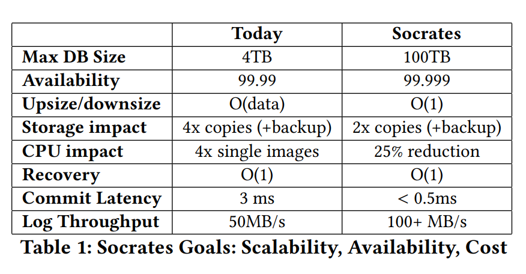
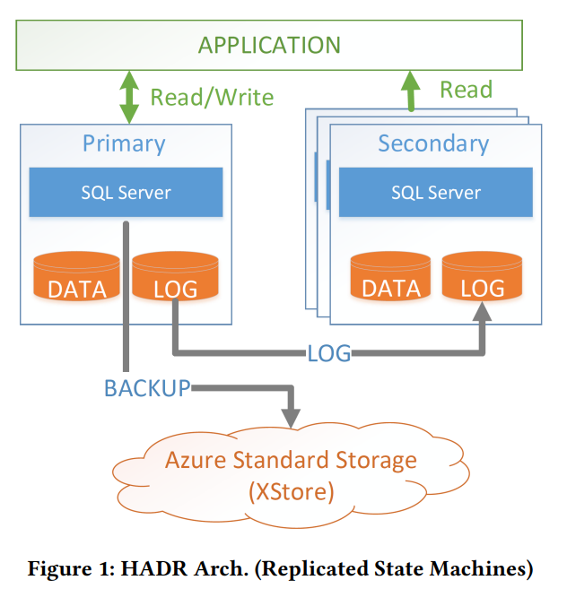
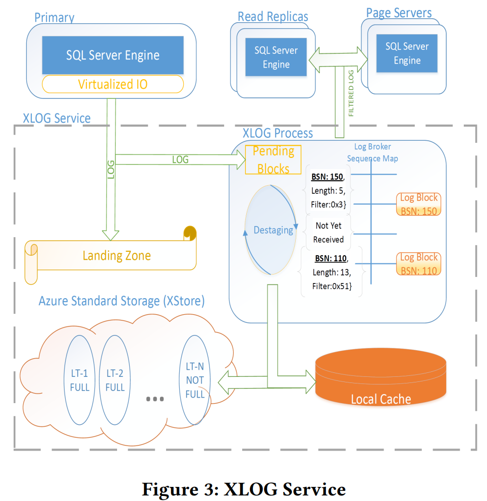
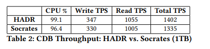
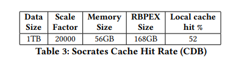
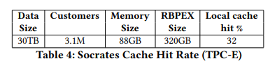
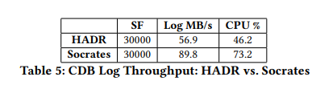

# Socrates: The New SQL Server in the Cloud

# Abstract

云中的数据库即服务（DBaaS）模式正变得越来越流行。组织采用这种模式是因为他们期望获得更高的安全性、更高的可用性以及更低且更灵活的成本和高性能。然而，很明显，在云中使用传统的单体数据库架构无法满足这些期望。本文提出了一种新颖的 DBaaS 架构，称为 Socrates。Socrates 已在 Microsoft SQL Server 中实现，并在 Azure 中以 SQL DB Hyperscale 的形式提供。本文描述了 Socrates 的关键理念和特性，并将 Socrates 的性能与 Azure 中以前的 SQL DB 产品进行了比较。

# Introduction

云服务已站稳脚跟。大多数初创公司都是云原生的。此外，许多大型企业正在将其数据和工作负载转移到云中。转移到云中的主要原因是安全性、上市时间以及更灵活的 “按需付费” 成本模式，这种模式可避免为未充分利用的机器支付过高费用。虽然所有这些原因都很有说服力，但人们期望数据库在云中的运行至少与在本地运行一样好（如果不是更好的话）。具体而言，客户期望 “数据库即服务” 具有高可用性（例如，99.999% 的可用性）、支持大型数据库（例如，100TB 的联机事务处理数据库）并且具有高性能。此外，该服务必须具有弹性，能够随着工作负载的增加和减少而扩展和收缩，以便客户能够利用按需付费模式。

事实证明，使用传统的单体数据库架构在云中无法满足所有这些要求。一个问题是成本弹性，这在本地数据库部署中似乎从未被考虑过：将大型数据库从一台机器转移到另一台机器以支持更高或更低的吞吐量并充分利用集群中的计算资源可能非常昂贵。另一个更微妙的问题是，在支持大型事务数据库和高可用性的目标之间存在冲突：高可用性需要较短的平均恢复时间，而传统上只有小型数据库才能实现这一点。这个问题在本地数据库部署中不会出现，因为这些部署通常使用特殊的、昂贵的硬件来实现高可用性（如存储区域网络或 SAN）；而这种硬件在云中不可用。此外，本地部署可以控制软件更新周期并精心计划停机时间；而在云中通常无法进行这种计划。

为了应对这些挑战，在过去十年中，人们对面向云的新型联机事务处理数据库系统架构进行了研究，例如 [5,8,16,17]。一个想法是分解数据库管理系统的功能，并独立部署计算服务（例如，事务处理）和存储服务（例如，检查点和恢复）。第一个采用这种想法的商业系统是亚马逊的 Aurora [20]。

本文介绍了 Socrates，这是一种源于微软在 Azure 中管理数百万个数据库的经验而诞生的联机事务处理数据库系统的新架构。Socrates 目前在 Azure 中以 SQL DB Hyperscale [2] 的品牌提供。

Socrates 设计采用了计算与存储分离的方式。此外，Socrates 将数据库日志与存储分离，并将日志视为一等公民。<u>正如我们将看到的，分离日志层和存储层将持久性（由日志实现）和可用性（由存储层实现）分离开来。</u>持久性是任何数据库系统避免数据丢失的基本属性。可用性是在出现故障时提供良好服务质量所必需的。

传统上，数据库系统通过将计算资源专门用于维护数据的多个副本的任务，将持久性和可用性的实现耦合在一起。然而，将这两个概念分离开来具有巨大的未开发潜力：（a）与可用性不同，持久性不需要在快速存储中有副本；（b）与持久性不同，可用性不需要固定数量的副本。分离这两个概念使 Socrates 能够为手头的任务使用最合适的机制。<u>具体而言，与目前市场上的其他数据库架构相比，Socrates 在快速本地存储中可以使用较便宜的数据副本、总体上更少的数据副本、更少的网络带宽以及更少的计算资源来保持副本的更新。</u>



表 1 显示了 Socrates 对 Azure 的 DBaaS 产品在数据库可扩展性、可用性、弹性、成本（CPU 和存储）以及性能（恢复时间、提交延迟和日志吞吐量）方面的影响。Socrates 具体如何实现这些改进是本文的主题。

本文的其余部分组织如下：第 2 节讨论了当前的技术水平。第 3 节总结了我们为构建 Socrates 而利用的现有 SQL Server 功能。第 4 节解释了 Socrates 的架构。第 5 节概述了 Socrates 中重要的分布式工作流。第 6 节展示了 Socrates 在解决成本 / 可用性 / 性能权衡方面的灵活性。第 7 节给出了性能实验的结果。第 8 节对本文进行总结，并提出了未来工作的可能方向。

# 2. STATE OF THE ART

本节将重新审视目前市场上使用的四个著名的数据库即服务（DBaaS）系统。



SQL DB 是微软在 Azure 中的数据库即服务。在 Socrates 出现之前，SQL DB 基于一种称为 HADR 的架构，如图 1 所示。HADR 是日志复制状态机的经典示例。有一个主节点处理所有更新事务，并将更新日志发送到所有从节点。在分布式数据库系统中，日志传送是保持副本一致的实际标准 [13]。此外，主节点定期将数据备份到 Azure 的标准存储服务（称为 XStore）：每五分钟备份一次日志，每天备份一次整个数据库的增量，每周进行一次完整备份。从节点可以处理只读事务。如果主节点发生故障，其中一个从节点将成为新的主节点。使用 HADR，SQL DB 需要四个节点（一个主节点和三个从节点）来保证高可用性和持久性：如果所有四个节点都发生故障，由于日志仅每五分钟备份一次，因此会发生数据丢失。

到目前为止，HADR 架构已成功用于 Azure 中部署的数百万个数据库。该服务稳定且成熟。此外，HADR 具有高性能，因为每个计算节点都有数据库的完整本地副本。不利的一面是，数据库的大小不能超过单个机器的存储容量。当长时间运行的事务发生时会出现一种特殊情况，即日志增长超过机器的存储容量，并且在长时间运行的事务提交之前无法截断日志。O（数据大小）操作也会产生问题。例如，为新节点播种的成本与数据库的大小呈线性关系。备份 / 恢复、纵向扩展和收缩是操作成本随数据库大小线性增长的其他示例。这就是为什么如今的 SQL DB 将数据库大小限制为 4TB（表 1）。

另一个基于日志复制状态机的著名云数据库系统示例是 Google Spanner [11]。为了解决 O（数据大小）问题，Spanner 自动将数据在逻辑上分片为称为分区的部分。使用 Paxos 协议 [9] 使分区的多个副本保持一致。只有其中一个分区（称为领导者）可以修改数据；其他分区是只读的。Spanner 支持地理复制，并在 TrueTime 设施（一种基于数据中心的时间源，可限制不同副本之间的时间偏差）的帮助下保持所有副本一致。为了实现负载均衡和容量管理，分区会动态地进行分割和合并。

> 没有分片，每个计算节点都配一个LOG和STORE节点，每个小集群都是一个全库。

在过去的十年中，一种称为共享磁盘的替代架构已被研究用于云中的数据库 [5,8,16,17]。

这种架构将计算和存储分离。AWS Aurora 是第一个采用这种架构的商业数据库即服务。一个 Aurora 主计算节点处理更新事务（与 HADR 类似），并且每个日志记录都被发送到六个存储服务器，这些存储服务器持久化数据。这六个存储服务器分布在三个可用区中，如果一个事务的日志在六个存储节点中的四个成功持久化，那么该事务就安全提交。在存储层中，数据（和日志）被分区以实现可扩展性。Aurora 支持可变数量的从计算节点，这些从计算节点连接到存储节点以获取数据页。

甲骨文开创了一种基于 Exadata 和 Oracle RAC 的不同的数据库即服务架构。在这种架构中，集群的所有节点在一个快速互连网络上紧密耦合，并且在一个分布式存储层上有一个共享缓存融合层，该存储层带有使用本地连接的闪存存储的存储单元 [3,7]。

# 3 IMPORTANT SQL SERVER FEATURES

Socrates 建立在 SQL Server 中已有的基础之上。本节介绍了几个重要（且并非显而易见）的 SQL Server 特性，这些特性是独立于 Socrates 开发的，并且对 Socrates 至关重要。

## 3.1 Page Version Store

SQL Server 为数据库记录维护版本，以便在存在并发写入者的情况下提供读取快照（例如，实现快照隔离 [4]）。在 HADR 架构中，所有这些版本控制都是在本地临时存储中完成的。正如在第 4 节中将变得清晰的那样，Socrates 采用了一种扩展的共享磁盘架构，这要求行版本不能再在本地临时存储中保存：计算节点也必须在共享存储层中共享行版本。

> 计算层只负责计算，和数据版本相关的内容都放到共享存储中。

## 3.2 Accelerated Database Recovery

SQL Server 利用持久版本存储推出了一个名为加速数据库恢复（ADR）的新功能。在 ADR 之前，SQL Server 使用一种 ARIES 风格的恢复方案 [18]，该方案首先分析日志，然后对在上一个检查点之前未提交的所有事务进行重做，最后对所有未提交（失败）的事务进行撤销。在这种方案中，在存在长时间运行的事务的情况下，撤销阶段可能会变得无限制地长。在拥有数百万个托管数据库的生产环境中，这种无限制的撤销阶段确实可能成为一个问题。

事实证明，**版本存储**可以显著改善这种情况：有了共享的持久版本存储，即使在发生故障后，系统也可以访问一行的已提交版本，这在许多情况下可以消除undo阶段，并且在分析和重做阶段之后，数据库立即可用，这是一个由检查点间隔限制的常量时间操作。

> 版本存储方案可以加速数据库恢复进程，某种情况下可以避免对失败的长事务进行撤销。

## 3.3 Resilient Buffer Pool Extension

2012 年，SQL Server 发布了一个名为缓冲池扩展（BPE）的功能，它将内存中数据库缓冲池的内容溢出到本地 SSD 文件中（在主内存和 SSD 之间使用相同的生命周期和淘汰策略）。在 Socrates 中，我们扩展了这个概念，使缓冲池具有弹性，即在故障后可恢复。我们将这个组件称为 RBPEX，它在计算层和存储层中都用作页面的缓存机制（第 4 节）。

<u>拥有像 RBPEX 这样可恢复的缓存大大减少了节点达到峰值性能（具有预热缓冲区）之前的平均恢复时间</u>：如果故障时间很短（例如，软件升级后机器重新启动），读取并应用（少数）更新页面的日志记录比从远程服务器重新获取所有（缓存）页面要便宜得多，而在传统的不可恢复缓存中需要从远程服务器重新获取所有页面。更短的平均恢复时间提高了可用性 [14]。

> 即节点在本地有一个SSD，存储了bp中当前状态的部分数据，当崩溃恢复的时候，将恢复的压力分摊到了远程服务器与本地SSD之中，因此意味着更短的恢复时间与更高的可用性。

从架构上讲，RBPEX 是一个简单、直接的概念。然而，对 RBPEX 的仔细实现、集成和管理对性能至关重要。如果做得不好，性能甚至可能下降。我们在内存存储引擎 Hekaton [15] 中将 RBPEX 构建为一个表，这确保了对 RBPEX 的读 I/O 与对本地 SSD 的直接 I/O 一样快。此外，Hekaton 在故障后恢复 RBPEX—— 就像任何其他 Hekaton 表一样。对 RBPEX 的写 I/O 需要仔细编排，因为不能允许 RPBEX 元数据 I/O 阻碍数据 I/O，并且不能允许 RBPEX 故障损坏 RBPEX 的状态。为了实现这一点，我们拦截了缓冲池页面生命周期跟踪机制，这是一个对性能非常敏感的组件。

## 3.4 RBIO protocol

正如我们将看到的，Socrates 将数据库引擎的组件分布在多个层级中。为了支持更丰富的计算分布，我们用一种名为远程块 I/O（简称 RBIO）的新协议扩展了传统的 SQL Server 网络层（称为统一通信栈）。RBIO 是一种无状态协议，强类型，支持自动版本控制，对瞬时故障具有弹性，并且对最佳副本选择具有服务质量（QoS）支持。

## 3.5 Snapshot Backup/Restore

SQL Server 2016 引入了一种能力，当数据库文件存储在 Azure 中时，可以进行几乎瞬间的备份。这个功能依赖于由 Azure 存储（XStore）实现的 blob 快照功能 [10]，它被组织为一个日志结构存储系统 [19]。在日志结构文件系统中，备份是一个恒定时间的操作，因为它只需要保留一个指向日志当前头部的指针（时间戳）。Socrates 通过使备份 / 恢复完全在 XStore 快照上工作来扩展这个功能。因此，Socrates 可以在恒定时间内进行备份（和恢复），而不会在计算层产生任何 CPU 或 I/O 成本。

借助 XStore 的快照机制，即使是数百 TB 的非常大的数据库的数据库文件也可以在几分钟内恢复。当然，应用日志以恢复到正确的时间点（使用 ADR）以及启动服务器并刷新恢复的数据库的缓存需要更长的时间，但这些操作都不依赖于数据库的大小。备份 / 恢复是一个突出的例子，其中 Socrates 从关键的操作工作流中消除了与数据大小相关的操作。

## 3.6 I/O Stack Virtualization

在 I/O 堆栈的最低层，SQL Server 使用一种称为“文件控制块”（FCB）的抽象。FCB 层在提供 I/O 功能的同时，抽象了底层设备的细节。使用这个抽象层，SQL Server 可以支持多种文件系统以及各种不同的存储平台和 I/O 模式。Socrates 广泛利用这个 I/O 虚拟化层，通过实现新的 FCB 实例，这些实例将 Socrates 的存储层次结构从计算进程中隐藏起来。这种方法帮助我们在不改变 SQL Server 大多数核心组件的情况下实现 Socrates：大多数组件“认为”它们是一个整体的、独立的数据库系统的组成部分，并且在 FCB 层之上没有组件需要处理 Socrates 实际上所具有的分布式、异构系统的复杂性。

# 4 SOCRATES ARCHITECTURE

## 4.1 Design Goals and Principles

如今，Azure 成功地使用第 2 节中描述的 HADR 架构托管了许多数据库。在生产环境中运行所有这些数据库让我们吸取了重要的经验教训，这些教训指导了 Socrates 的设计。在解释 Socrates 架构之前，我们先描述这些经验教训以及相应的 Socrates 设计目标和原则。

### 4.1.1 Local Fast Storage vs. Cheap, Scalable, Durable Storage

第一个经验教训与存储层次结构有关：高性能需要直接连接存储（SSD），而大型数据库的持久性和可扩展性需要廉价存储（硬盘）。在本地环境中，这些要求由像存储区域网络（SAN）这样的存储系统来满足，它们在一个单一的存储堆栈中透明地优化不同种类的存储设备。<u>在云中，这样的存储系统并不存在；</u>相反，每台机器都有本地存储（SSD），它速度快、容量有限且不持久，因为当机器永久故障时它会丢失。此外，像 Azure 这样的云提供了一个单独的远程存储服务，用于廉价、无限制、持久的存储。为了在云中实现良好的性能、可扩展性和持久性，Socrates 有一个分层的、可扩展的存储架构，它明确地管理 Azure 中可用的不同存储设备和服务。这个架构的一个具体特点是，它避免了快速增长的数据库动态存储分配中的碎片化和昂贵的数据移动。

> 每台机器都有一个局部的SSD，Socrates本身有一个分层、可扩展的存储架构。

### 4.1.2 Bounded-time Operations

如表 1 所示，Socrates 的一个重要设计目标是支持 100TB 量级的大型数据库。不幸的是，当前的 HADR 架构涉及许多操作，其性能取决于数据库的大小，如第 2 节所述。快速创建新副本对于以低成本实现高可用性特别重要，因为这个操作决定了平均恢复时间，而平均恢复时间直接影响给定副本数量下的可用性 [14]。避免任何 “与数据大小相关的操作” 的要求，促使我们为备份 / 恢复（基于快照）、数据库日志管理（暂存）、带有异步副本播种的分层缓存、以及利用可扩展存储服务，为如上的几个需要开发新的机制。

### 4.1.3 From Shared-nothing to Shared-disk

HADR 架构（以及任何其他复制状态机数据库管理系统架构）的基本原则之一是每个副本都维护数据库的本地副本。这个原则与我们支持几百 TB 大型数据库的设计目标相冲突，因为没有一台机器有那么大的存储容量。即使有可能，在 HADR 中把数据库放置在机器上时，存储会成为限制因素和主要标准；结果，如果一个大的（比如 100TB）数据库以相当轻的工作负载部署，那么 CPU 周期就会被浪费。

这些观察促使我们从 HADR 的无共享模型（以及复制状态机）转向共享磁盘设计。在这个设计中，执行事务和查询的所有数据库计算节点都可以访问相同的（远程）存储服务。跨数据库节点共享数据需要在不同级别支持数据版本控制。为此，Socrates 依赖于第 3.1 节中描述的共享版本存储。共享版本存储和加速恢复（ADR，第 3.2 节）的结合使得新的计算节点能够快速启动，并将 Socrates 中的读扩展性边界远远推到 HADR 所能达到的范围之外。

### 4.1.4 Low Log Latency, Separation of Log

日志是任何联机事务处理（OLTP）数据库系统的潜在瓶颈。在事务可以提交之前，每个更新都必须被记录到日志中，并且日志必须被发送到数据库的所有副本以保持它们的一致性。问题是如何在云规模上提供一个高性能的日志解决方案？

Socrates 对这个问题的答案是提供一个单独的日志服务。这样，我们可以专门针对其特定的访问模式调整和定制日志。首先，Socrates 通过复制日志使日志具有持久性和容错性：一旦事务的日志记录被持久化，事务就可以提交。事实证明，我们实现的用于强化日志记录的法定人数比在复制状态机（例如 HADR）中实现法定人数更快。因此，如表格 1 所示，Socrates 可以实现更好的提交性能。

> 数据日志分离后，事务提交会更快。

其次，如果日志与其他数据库组件解耦，那么读取和发送日志记录会更加灵活和可扩展。Socrates 利用日志访问的不对称性：最近创建的日志记录需求很高，而旧的日志记录只在特殊情况下（例如，中止和撤销一个长时间运行的事务）才需要。因此，Socrates 将最近的日志记录保存在主内存中，并以可扩展的方式分发它们（可能分发到数百台机器），而旧的日志记录则被卸载并仅在需要时才可用。

> 近期的日志是热点数据，所以放到缓存。久远的日志则放到稳定存储中即可，用的频率并不高。

第三，分离日志使得站在巨人的肩膀上并插入任何外部存储设备来实现日志成为可能。如附录 A 所示，这个功能已经开始产生回报，因为 Socrates 可以利用 Azure 存储中的最新创新，而无需改变其任何架构原则。特别是，这个功能允许 Socrates 在无需实现自己的日志发送、gossip法定人数协议或日志存储系统的情况下实现低提交延迟。

> 可以对日志节点集群的底层存储模型进行定制化，即日志节点底层存储和数据节点存储可以独立的进行升级发展，实现了真正的解耦。

### 4.1.5 Pushdown Storage Functions

共享磁盘架构的一个优点是它使得可以将功能从计算层卸载到存储层，从而将功能移动到数据所在的位置。这样，Socrates 可以实现显著的性能提升。最重要的是，每个可以卸载到存储的数据库功能（无论是备份、检查点、I/O 过滤等）都可以减轻主计算节点和日志的负担，它们是系统的两个瓶颈。

### 4.1.6 Reuse Components, Tuning, Optimization

SQL Server 有一个丰富的生态系统，有许多工具、库和现有的应用程序。Azure 中现有的数百万个 SQL 数据库上的应用程序必须以无缝的方式迁移到 Socrates。此外，与可能有一天会迁移到 Azure 的数百万个本地 SQL Server 数据库的完全向后兼容性也是重中之重。因此，Socrates 需要支持相同的 T-SQL 编程语言和用于管理数据库的基本 API。此外，SQL Server 是一个企业级数据库系统，在健壮性（测试）和高性能方面有几十年的投入。在任何情况下，我们都不想也不能重新发明轮子并降低客户体验。所以，SQL Server 的关键组件，如查询优化器、查询运行时、安全性、事务管理和恢复等都保持不变。此外，Socrates 数据库的调整方式与 HADR 数据库相同，并且 Socrates 在特定工作负载下（例如，对热行的重复更新）的行为与 HADR 类似。Socrates（像 HADR 一样）也采用纵向扩展架构以实现高吞吐量，因为这是最先进的技术，并且对于大多数 OLTP 工作负载来说已经足够。

## 4.2 Socrates Architecture Overview


图 2 展示了Socrates架构。后面会清楚地看到，它遵循了上一节中概述的所有设计原则和目标：（a）计算与存储分离，（b）分层且可扩展的存储，（c）有界操作，（d）日志与计算和存储分离，（e）将功能转移到存储层的机会，以及（f）复用现有组件。

Socrates架构有四层。应用程序连接到计算节点。和 HADR 一样，有一个主计算节点处理所有的读 / 写事务。可以有任意数量的从计算节点，它们处理只读事务或者作为故障转移的目标。计算节点以和现在相同的方式实现查询优化、并发控制和安全，并且支持 T-SQL 和相同的 API（4.1.6 节）。如果主节点出现故障，其中一个从节点会成为新的主节点。<u>所有计算节点在主内存和固态硬盘上的弹性缓冲池中缓存数据页（3.3 节）。</u>

Socrates架构的第二层是 XLOG 服务。这一层实现了 “日志分离” 原则，这在 4.1.4 节中有说明。虽然这种日志分离在以前的文献中就有提出过 [6,8]，但这种日志分离使Socrates与其他云数据库系统（如Amazon Aurora[20]）有所不同。XLOG 服务在存储层实现了低提交延迟和良好的可扩展性（可扩展）。由于主节点处理所有的更新（包括 DML 操作），所以只有主节点向日志写入。这种单一写入者的方法在写入日志时保证了低延迟和高吞吐量。所有其他节点（例如从节点）以异步方式消费日志，以保持它们的数据副本是最新的。

第三层是存储层。它由页面服务器实现。每个页面服务器都有数据库分区的一个副本，从而部署了一个可扩展的存储架构，正如我们将看到的，这有助于按照 4.1.2 节中的假设（所有操作都是有界的-与数据大小无关）来限制所有操作。页面服务器扮演两个重要角色：首先，它们为计算节点提供页面。每个计算节点都可以从页面服务器请求页面，遵循共享磁盘架构（4.1.3 节）。我们目前正在页面服务器中实现批量操作，如批量加载、索引创建、数据库重组、深度页面修复和表扫描，以进一步减轻计算节点的负担，如 4.1.5 节所述。在第二个角色中，页面服务器在 XStore（第四层）中为数据页建立检查点并创建备份。和计算节点一样，页面服务器将所有数据保存在主内存或本地连接的固态硬盘中，以便快速访问。

第四层是 Azure 存储服务（称为 XStore），这是由 Azure 独立于Socrates和 SQL DB 提供的现有存储服务。XStore 是一个高度可扩展、持久且廉价的基于硬盘的存储服务。数据访问是远程的，并且在那个规模和价格点上，存储会有吞吐量和延迟限制。将带有本地连接的快速存储的页面服务器与持久、可扩展、廉价的存储分开，实现了 4.1.1 节中概述的设计原则。

> 将page数据进一步分为冷热数据，映射到架构上就是将数据节点进一步分为数据节点+远程稳定存储层，数据节点有local cache和本地SSD存储较为热点的数据页；远程的XStore采用廉价磁盘阵列，保存所有数据，确保持久性。

**计算节点和页面服务器是无状态的。**它们可以在任何时候出现故障而不会丢失数据。数据库的 “真相” 存储在 XStore 和 XLOG 中。XStore 非常可靠，并且实际上所有 Azure 客户多年来一直在使用它而没有数据丢失。Socrates利用了这种稳健性。XLOG 是我们专门为Socrates构建的新服务。它有很高的性能要求，必须是可扩展的、经济实惠的，并且绝不能丢失任何数据。接下来我们将更详细地描述我们对 XLOG、计算节点和页面服务器的实现。

> 注意计算节点与数据节点是无状态的，XLOG层与XStore本身确保持久性。

## 4.3 XLOG Service



图 3 展示了 XLOG 服务的内部结构。从图 3 的左上角开始，主计算节点直接将日志块(Log Blocks)写入着陆区（LZ），这是一种快速且持久的存储服务，能在数据完整性、弹性和一致性方面提供强有力的保证；换句话说，这是一种具有类似存储区域网络（SAN）功能的存储服务。当前版本的 SQL DB 超大规模版使用 Azure 高级存储服务（XIO）来实现着陆区（LZ）。为了保证持久性，XIO 会保留所有数据的三个副本。和每一种存储服务一样，这里存在性能、成本、可用性和持久性的权衡。此外，这个领域有很多创新。Socrates 自然会从这些创新中受益。附录 A 通过展示使用替代存储服务而非 XIO 的性能影响来研究这种效果。

主节点同步且直接地将日志块写入 LZ，以实现尽可能低的提交延迟。LZ 旨在快速（可能很昂贵）但容量较小。LZ 被组织为一个循环缓冲区，并且日志的格式是对微软所有 SQL 服务和产品中使用的传统 SQL Server 日志格式的向后兼容扩展。这种方法遵循了不重复造轮子的设计原则（4.1.6 节），并保持了 Socrates 与所有其他 SQL Server 产品和服务之间的兼容性。

这种日志扩展的一个关键特性是，它允许并发的日志读取者在有日志写入者的情况下读取一致的信息，而无需任何同步（除了环绕保护之外-对landing zone的读写并发保护）。在各层之间最小化同步会导致一个更具可扩展性和弹性的系统。

> “Wraparound protection”（环绕保护）通常用于数据存储和处理的场景中，特别是在处理像环形缓冲区（circular buffer）这样的结构时。
>
> 在环形缓冲区中，数据像在一个环形（循环）的空间里存储和读取。当数据的写入或读取指针到达缓冲区的末尾时，它们会 “环绕” 回到开头继续操作。
>
> “Wraparound protection” 就是一种机制，用于确保在这种环绕情况发生时数据的正确处理。比如，防止读取指针超过写入指针一圈后错误地读取还未写入的数据，或者防止写入指针覆盖还没被读取的数据等问题。这有点像在环形跑道上跑步，你需要一些规则（保护机制）来确保跑步的顺序和位置正确，避免碰撞或者跑错路线。
>
> 在日志读取和写入的场景下，它也是类似的作用，确保日志读取者在循环式的日志格式下能正确读取日志信息，避免读取混乱或出错。

主节点还将所有日志块写入一个特殊的 XLOG 进程，该进程将日志块传播到页面服务器和从节点。这些写入是异步的，并且可能使用一种有损协议而不可靠（即发即弃的方式，只管发，不用确保可靠性）。可以这样理解这个方案：**Socrates 同步且可靠地写入 LZ 以保证持久性，并异步地写入 XLOG 进程以保证可用性。**

> 可以将日志节点层视为有landing zone和XLOG process两个缓冲部分，对landing zone的写入必须是可靠的；对XLOG process则是尽力的去写，而不用确保成功。有点类似于TCP和UDP的区别。

主节点并行地将日志块写入 LZ 和 XLOG 进程。如果没有同步，可能会出现这样的情况，比如一个日志块在 LZ 中还未实现持久性时就到达了一个从节点。我们将这种不同步的方法称为推测性日志记录（speculative logging），在出现故障时，它可能会导致不一致和数据丢失。

为了避免这些情况，XLOG 只传播已固化（持久化）的日志块。已固化的块是那些已经在 LZ 中实现持久性（已经写入到大多数日志节点，即write quorum）的块。为此，主节点首先将所有日志块写入 XLOG 进程的 “pending area”。此外，主节点会将所有已固化的日志块通知给 XLOG。一旦一个块被固化，XLOG 就会将其从 “pending area” 移动到日志代理（LogBroker）进行传播；XLOG process同时也会填补Log Broker中的间隙，并对来自有损协议的乱序块进行重新排序，以便写入 “pending area”。

> XLOG process在把log block写入pending area之前，会进行一个重排序，以确保pending area中的redo log block是有序的。
>
> 前面已知XLOG process负则将日志异步的发往page节点与从计算节点，为了确保一致性与数据的可靠性，我们规定XLOG process只能发送landing zone中已经持久化的redo log block，因为MySQL本身是以Block为单位发送redo log的。

为了传播和归档日志块，XLOG 进程实现了一个存储层次结构。一旦一个块被移动到日志代理（LogBroker）中（意味着已经成功写入了landing zone，被成功持久化），一个名为 “转出”（destaging）的内部 XLOG 进程会将日志移动到一个固定大小的本地固态硬盘缓存中以便快速访问，并移动到 XStore 中进行长期保留。

再次强调，XStore 价格便宜、容量大、持久但速度较慢。我们将这个用于日志块的长期存档称为 LT。如果没有另外指定，SQL DB 会为时间点恢复和具有模糊备份的灾难恢复保留 30 天的日志记录。如果将 30 天的日志记录都保存在 LZ 中，那将非常昂贵，因为 LZ 是一种低延迟但昂贵的服务。这个转出(Destaging)管道必须仔细调整：一旦 LZ 中充满了尚未转出的日志记录，Socrates 就无法处理任何更新事务。虽然这种分层架构很复杂，但不再需要其他日志备份过程；在 LZ 和 LT（XStore）之间，所有的日志信息都被持久存储。<u>此外，这个层次结构满足了我们所有的延迟要求（在 LZ 中快速提交）和成本要求（在 XStore 中进行大容量存储）。</u>

> LZ是一个低延迟但是昂贵的持久存储服务。

消费者（从节点、页面服务器）从 XLOG 服务中拉取日志块。这样，架构更具可扩展性，因为日志代理不需要跟踪日志消费者，可能有数百个页面服务器。在顶层，日志代理有一个日志块的主内存哈希映射（在图 3 中称为序列映射（Sequence Map））。在一个理想的系统中，所有的日志块都从这个序列映射中提供。如果在序列映射中找不到数据，下一层是 XLOG 进程的本地固态硬盘缓存。这个本地固态硬盘缓存是日志尾部的另一个循环缓冲区。如果一个消费者请求一个已经从本地固态硬盘缓存中老化（被淘汰出去）出去的块，那么日志块将从 LZ 中获取，如果在 LZ 中也找不到，那么作为最后手段，从 LT 中获取，在 LT 中肯定能找到日志块。

> 日志层中获取日志的先后逻辑，前面找不到就顺延下一个：
>
> 1. 主内存哈希映射。即Block LSN->Log Block。理论上大部分请求都从这里处理。
> 2. 日志层的Local Cache。SSD磁盘，存的是从1中淘汰出来的内容，相当于二级缓存。
> 3. Landing Zone区域，快速且昂贵。存储近期已经被固化的日志。
> 4. XStore-LT区域。廉价存储设施，存储所有的日志，提供持久性。

XLOG 进程实现了分布式数据库即服务（DBaaS）系统所需的一些其他通用功能：日志生命周期的租约、LT 块清理、备份 / 恢复记账、为日志消费者提供进度报告、块过滤等等。所有这些功能都经过精心选择，以保持 XLOG 进程的无状态性质，便于轻松进行水平扩展，并避免影响 XLOG 的主要功能，即提供和转出日志。

## 4.4 Primary Compute Node and GetPage@LSN

Socrates 主计算节点的行为几乎与本地安装的 SQL Server 中的独立进程相同。数据库实例本身并不知道其他副本的存在。它不知道其存储是远程的，或者日志没有保存在本地文件中。相反，HADR 主节点清楚自己参与的是一个复制状态机，并通过达成法定人数来加固日志和提交事务。特别地，HADR 主节点与所有的从节点紧密耦合，彼此互相了解。因此，Socrates 主节点更简单一些。

然而，主节点的核心功能是相同的：处理读写事务并生成日志。与本地 SQL Server 相比，有几个显著的不同之处：

- 存储级别的操作，如检查点、备份/恢复、页面修复等，委托给页面服务器和更低的存储层。
- Socrates 主节点通过第 3.6 节中提到的虚拟化文件系统机制将日志写入 LZ。该机制产生的 I/O 模式与第 4.3 节中描述的 LZ 概念兼容。
- Socrates 主节点使用 RBPEX 缓存（第 3.3 节）。RBPEX 作为 I/O 虚拟化层之上的一层被透明集成。
- 或许最大的区别是，Socrates 主节点并不保留数据库的完整副本。它仅缓存存储在主内存缓冲区和 SSD（RBPEX）中的热数据部分。

这个最后的区别要求主节点拥有一个机制，用于从本地节点检索未缓存的页面。我们称这个机制为 **GetPage@LSN**。GetPage@LSN 是一种远程过程调用，由主节点从 FCB I/O 虚拟化层使用 RBIO 协议（第 3.4 节）发起。这个调用的原型如下所示：

```latex

getPage(pageId, LSN)
```

在这里，`pageId` 唯一标识主节点需要读取的页面，而 `LSN`（日志序列号）标识页面的日志序列号，其值至少与该页面的最后一个 `PageLSN` 相同或更高。页面服务器（第4.6节）返回一个页面版本，该版本已应用所有直到此 `LSN` 或更高版本的更新。

> 即page server返回的版本一定是≥GetPage请求中携带的LSN的。

为了理解这个机制的必要性，考虑以下事件顺序：

1. 主节点（Primary）在本地缓冲区更新了页面 X。

2. 主节点因内存压力或累积活动而将页面 X 从本地缓冲区（包括缓冲池和 RBPEX）中逐出。在逐出页面之前，主节点遵循写前日志（WAL）协议[18]，并将所有描述对页面 X 的更改的日志记录刷新到 XLOG。

   > 当主节点逐出数据页的时候，会触发WAL协议，会把与该page相关的日志记录都持久化到XLOG中。即：假设稳定存储上版本为v1，逐出的页面当前版本为v2(v2 > v1)。则会把[v1,v2]区间版本的相关日志全部持久化到稳定存储中。
   >
   > 这一机制与后面主节点确认GetPage中的LSN值有很大关系。

3. 主节点再次读取页面 X。

在这种情况下，重要的是，在步骤 3 中，主节点能看到页面 X 的最新版本，因此，它发出一个 `getPage(X, X-LSN)` 请求，其中的 X-LSN 确保页面服务器返回页面的最新版本。为了保证数据的新鲜度，页面服务器按以下方式处理 `getPage(X, X-LSN)` 请求：

1. 等待直到它应用了所有 XLOG 中的日志记录，直到达到 X-LSN。
2. 返回页面 X。

这个简单的协议足以确保页面服务器不会向主节点返回过时的页面 X 版本。（有关页面服务器的更多细节，请参见第4.6节。）

我们还没有描述主节点如何知道在发出 `getPage(X, X-LSN)` 调用时应使用哪个 X-LSN。理想情况下，X-LSN 应该是页面 X 的最新页面 LSN。然而，主节点无法记住它已逐出的所有页面的 LSN（实际上是整个数据库）。相反，主节点构建了一个哈希映射（以 pageId 为键），在每个桶中存储了每个已逐出页面的最大 LSN，键为 pageId。<u>由于页面 X 曾在某个时刻从主节点中逐出，这种机制将确保提供一个 X-LSN 值，该值至少与页面 X 的最大 LSN 相同，从而保证安全性。</u>

> 由于逐出页面的过程中，页面会被持久化到稳定存储（如磁盘）上，因此这个机制实际上意味着主节点在请求页面时，能够获得一个保证至少与稳定存储中的版本相等或更新的页面版本。即主节点始终可以获取到≥稳定存储上的版本。
>
> 因此，页面服务器所返回的页面版本不仅是最近的版本，而且该版本已经被持久化到存储中，确保其一致性和可靠性。所以，这个机制保证了主节点获得的页面版本不会低于稳定存储中的版本，而是可以满足大于或等于这个版本的要求，从而确保数据的最新性和正确性。

## 4.5 Secondary Compute Node

根据重用设计原则（第4.1.6节），Socrates Secondary 共享与 HADR 中相同的日志应用功能。一个简化的区别是，Socrates Secondary 无需保存和持久化日志块，因为这由 XLOG 服务负责。此外，Socrates 是一种松耦合架构，因此 Socrates Secondary 不需要知道日志的生产者（即，哪个节点是 Primary）。与 HADR 一样，Socrates Secondary 处理只读事务（使用快照隔离 [4]）。像查询处理器、安全管理器和事务管理器等最重要的组件，几乎与独立 SQL Server 和 HADR 保持不变。

与 Primary 类似，Socrates 和 HADR 之间的最显著区别来自于 Socrates Secondaries 没有数据库的完整副本。这一事实对实现支持大规模数据库并使计算节点无状态（仅带缓存）的目标至关重要。因此，可能出现 Secondary 处理与其缓冲区中不存在的页面相关的日志记录的情况（既不在主内存中，也不在 SSD 上）。针对这种情况，可以设想不同的策略。一个可能的策略是：获取页面并应用日志记录。这样，Secondary 的缓存大致与 Primary 的缓存保持相同的状态（至少对于已更新的页面而言），在故障转移到 Secondary 后，性能会更加稳定。

<u>当前 SQL DB Hyperscale 实现的策略是，对于涉及未缓存页面的日志记录，直接忽略这些记录。</u>这种策略导致了一个有趣的竞争条件，因为缓存存在性检查可能与来自于 Secondary 正在处理的只读事务中的、并发出现的、且待处理的 `GetPage@LSN` 请求发生冲突。为了解决这个冲突，Secondary 必须在实际调用之前注册 `GetPage@LSN` 请求，且 Secondary 的日志应用线程会将待处理的 `GetPage@LSN` 请求的日志记录排队，直到页面被加载。

另一个有趣的竞争条件出现在 Secondary 进行 B-tree 遍历以处理只读事务时。Secondary 与 Primary 一样，采用相同的 `GetPage@LSN` 协议从页面服务器获取页面。同样，Secondary 也维护一个 `PageLSN` 缓存，以保守地确定正确的 LSN。这个 LSN 通常低于 Primary 在同一时刻写入的最新 LSN。

> 因为Secondary的应用日志进度相比于Primary而言会存在一定的滞后性。

**这种机制可能会导致不一致性**。考虑以下作为 B-tree 遍历的一部分的情况：

- Secondary 读取 B-tree 节点 P，其 LSN 为 23。（Secondary 已经应用了直到 LSN 23 的日志。）
- 接下来的节点 C，节点 P 的子节点，不在缓存中。Secondary 发出 `getPage(C, 23)` 请求。
- 页面服务器返回 LSN 为 25 的页面 C，遵循第 4.4 节中描述的协议。

根据 `GetPage@LSN` 协议，页面服务器可能会返回未来版本的页面，这可能会导致不一致。例如，假设页面 C 在时间 24 被拆分了。在这种情况下，Secondary 从当前（拆分之前）查看了页面 P，但从未来（拆分之后）查看了页面 C，这可能导致错误的结果。

幸运的是，这种不一致性是可以检测到的。如果 Secondary 在索引遍历过程中检测到这种不一致性，它将暂停并给日志应用线程一些时间，以便消费更多日志并刷新过时的索引页面（即页面 P）。暂停后，它将重新启动 B-tree 遍历，并希望此时索引结构已经一致。

> 为了检测这种不一致性，系统依赖于 **快照隔离** 和 **版本存储**。当 Secondary 进行索引遍历时，它依赖于其 **PageLSN 缓存** 来保守地确定应该使用哪个 LSN。如果它在遍历过程中遇到版本不匹配的情况，比如当读取的一个页面版本较新（来自未来），而另一个页面版本较旧（来自过去），就会出现不一致性。

这里的关键洞察是，SQL Server 中的持久数据结构已经被设计成，即使物理上获得的页面来自不同时间点（从 LSN 角度来看），也能在逻辑上实现一致的遍历。逻辑遍历依赖于第 3.1 节中描述的版本存储，根据事务时间戳（使用快照隔离）从页面中提取正确版本的记录。

> 在这个机制中，当一个事务在进行 B-tree 遍历或其他查询时，它并不直接读取当前最新的页面，而是通过事务的时间戳来查找符合快照隔离要求的记录版本。**undo 版本链**为每个页面提供了不同版本的历史记录，因此，尽管页面的物理存储可能来自不同的时间点（LSN），**逻辑上的遍历**依然是一致的。SQL Server 会通过 **undo日志** 来回滚到正确的版本，确保读取的数据符合该事务开始时的快照隔离要求。

## 4.6 Page Servers

**Page Server** 的职责包括：

1. 通过应用日志来维护数据库的分区，
2. 响应来自计算节点的 `GetPage@LSN` 请求，
3. 执行分布式检查点和备份操作。

遵循第 4.1.6 节中的重用原则，Page Server 执行日志应用任务的方式类似于第 4.5 节中描述的 Secondaries。与 Secondaries 不同，后者需要关注数据库中的所有变化，因此需要消费所有的日志块，而 Page Server 只关心那些涉及其所管理的数据库分区中页面的日志块。为此，**Primary** 会为每个日志块提供足够的带外注释，指示该日志块中的日志记录影响哪些分区。XLOG 使用这些过滤信息来将相关的日志块仅发送给对应的 Page Server。

处理 `GetPage@LSN` 请求也很简单。Page Server 仅需遵循第 4.4 节中的协议。为此，Page Server 也使用 **RBPEX**，一种扩展的、可恢复的 SSD 缓存。使用 RBPEX 的机制与计算节点相同，但策略有所不同。计算节点缓存最热的页面以获得最佳性能；它们的缓存是稀疏的（`sparse`）。相比之下，Page Server 缓存的是那些不够热但仍需要缓存的页面，即那些没有进入计算节点缓存的页面。<u>因此，SQL DB Hyperscale 当前实现的 Page Server 使用覆盖缓存（covering cache）；即将分区的所有页面都存储在 Page Server 的 RBPEX 中</u>。此外，Socrates 将 Page Server 的 RBPEX 组织成保持步进（`stride-preserving`）的布局，这样来自计算节点的单个跨越多页范围的 I/O 请求就会转换为 Page Server 的单一 I/O 请求。由于 Page Server 的缓存是密集的，它不会遇到读取放大的问题，而计算节点的稀疏 RBPEX 缓存则可能会出现这一问题。这个特性对于通常需要读取多达 128 页的扫描操作的性能至关重要。

> `stride-preserving`为了避免这种 I/O 放大（即多次读取），stride-preserving 布局将连续的页面存储在存储设备的连续位置或者在存储布局中保持某种顺序，从而在一个 I/O 请求中能够读取多个页面。这种布局方式有助于优化大范围数据扫描（如读取多个页面进行查询或索引操作）。即一次I/O就可以读取一批数据页，这些数据页都是计算层需要的。
>
> **稀疏缓存**：
>
> - **稀疏缓存**是指缓存中存储的页面数量相对较少，即缓存中只存储最“热”的、最常被访问的页面。其他不常用的页面不会被存储在缓存中。
> - 这种缓存策略的优势是能够确保缓存中的数据是最常用的，从而提升数据访问的效率和性能。然而，它也有一个缺点——当请求一些不常用的数据时，这些数据可能不在缓存中，需要从磁盘或其他存储介质重新加载，导致访问延迟。
> - **计算节点的缓存**通常是稀疏的，因为计算节点通常只需要缓存最频繁访问的页面，目的是提高计算性能。
>
> **密集缓存**：
>
> - **密集缓存**则是指缓存中存储了大量的页面，甚至可能是该分区或存储范围内的所有页面。与稀疏缓存不同，密集缓存尽量将所有可能的页面都存储在缓存中，即使它们不常被访问。
> - 这种策略的优势是，即使是那些不常访问的页面也能直接从缓存中获取，避免了频繁的磁盘访问，从而提高了性能，尤其是在需要进行大量扫描或读取连续数据时。
> - **Page Server 的缓存**通常是密集的，因为 Page Server 需要缓存整个分区的数据，以便快速响应来自计算节点的大范围页面请求。

Page Server 缓存的另一个重要特点是它能够提供对短暂性 XStore 故障的隔离。在 XStore 故障期间，Page Server 会继续运行，并且会记住那些已写入 RBPEX 但尚未写入 XStore 的页面，待 XStore 恢复在线后，检查点操作会恢复，并且 XStore 会同步。相同的机制还允许 Socrates 将发送到 XStore 的多个 I/O 请求合并为一个大的写入操作，从而最大化底层存储服务的吞吐量。

最后，当一个新的 Page Server 启动时，其 RBPEX 会异步进行初始化，同时 Page Server 已经可以响应请求并应用日志。将长时间运行的操作（如新 Page Server 的初始化）与其他操作任务解耦是 Socrates 在各层设计中试图贯彻的关键原则之一。

最后，Page Server 通过与 XStore 的交互来执行检查点和备份操作。Page Server 与 XStore 在这些操作中的协作方式将在下一小节中详细讨论。

## 4.7 XStore for Durability and Backup/Restore

如前述各节所示，数据库的真实数据存储在 **XStore** 中。XStore 的具体细节可以参考 [10]。简而言之，XStore 是廉价的（基于硬盘）、持久的（通过高程度的跨可用区复制几乎没有数据丢失），并且通过使用日志结构化设计提供高效的备份和恢复（备份只需记录一个日志指针）[19]。但 XStore 可能比较慢。Socrates 架构中的所有其他组件的目标是提升性能和可用性。**换句话说，XStore 在 Socrates 中扮演着与传统数据库系统中硬盘和磁带相同的角色，而计算节点和 Page Server 的主内存与 SSD 缓存（RBPEX）则在 Socrates 中扮演着传统系统中主内存的角色。**

一旦理解了这些类比，就可以直观地理解 Socrates 是如何进行检查点、恢复（recovery）、备份和恢复（restore）操作的。

- 对于检查点操作，Page Server 定期将已修改的页面传输到 XStore。
- 备份通过 XStore 的快照功能实现，使用该功能可以通过简单地记录时间戳来在常数时间内创建备份[10]。
- 当用户请求**时间点恢复操作**（Point-In-Time-Restore Operation，PITR）时，该操作只需要将数据库恢复到指定的时间点状态。restore工作流会确定：（i）在 PITR 请求时间之前创建的所有快照，以及（ii）将这些快照从创建时间恢复到请求时间所需的日志范围。然后，这些快照将被复制到新的 blob 中，并开始恢复操作，将每个 blob 附加到新的 Page Server 实例，启动新的 XLOG 进程并应用日志，将数据库恢复到请求的 PITR 时间点。

这种 Socrates 的 PITR 过程比当前 HADR 中的要高效得多。像拍摄快照一样，在 XStore 中恢复快照是一个简短的元数据操作，可以在常数时间内完成（与数据大小无关）。此外，数据库几乎可以立即可用，因为新的 Page Server 可以立即开始提供restore后的数据库页面。然而，性能会在缓存恢复之前有所下降，因为页面需要首先从 XStore 获取并恢复。这个例子再次证明了利用现有云服务的重要性（第 4.1.4 节）。

## 4.7.1 Restore 和 Recovery的区别

在数据库中，**restore**（恢复）和 **recovery**（恢复处理）是两个密切相关但有显著不同的概念，主要区别在于操作的焦点和实施方式。

### 1. **Restore（恢复）**

- **定义**：Restore 通常指从备份中恢复数据。它是恢复数据的第一步，目的是将数据库的状态恢复到某个特定的时间点，通常是从磁带、硬盘或云存储等备份介质中读取数据，并将其恢复到数据库系统中。

- **目标**：Restore 旨在恢复整个数据库的内容或某个部分，通常是备份创建时的完整数据集。

- 操作流程：

  1. 从备份中提取数据（完整备份、增量备份或差异备份）。
  2. 将数据写回数据库中，恢复数据库到备份时的状态。
  3. 恢复过程通常是物理上的恢复，可能包括文件恢复、表格恢复等。

  示例：从最近的备份中恢复数据库，将所有表、索引和数据恢复到备份创建时的状态。

### 2. **Recovery（恢复处理）**

- **定义**：Recovery 通常指的是在数据库恢复过程中应用额外的日志（如事务日志或增量日志）以恢复数据库到最新的可用状态。这个过程通常在 restore 操作之后进行，尤其是在数据库恢复到某个时间点后。

- **目标**：Recovery 的目的是保证在恢复备份后，数据库可以继续到达最后一致的状态，所有已提交的事务都被完整应用，且没有丢失任何数据。

- **操作流程**：

  1. **恢复日志**：在 restore 完成后，数据库会应用存储在事务日志中的所有日志记录，以确保恢复到请求的时间点，通常是通过恢复应用所有已提交事务的日志来完成。
  2. **事务一致性**：确保数据库状态的一致性，处理未提交的事务（例如回滚），并应用所有必要的修改。

  **示例**：restore操作完成后，应用事务日志文件，将数据库状态恢复到某个精确的时间点或最终一致的状态。因此recovery操作需要有restore操作的结果作为基础。

### **区别总结**

| 特性         | Restore                                  | Recovery                                     |
| ------------ | ---------------------------------------- | -------------------------------------------- |
| **定义**     | 从备份中恢复数据库内容                   | 应用日志文件，使数据库恢复到一致状态         |
| **操作对象** | 主要是从备份中提取并恢复数据文件         | 主要是应用事务日志，恢复事务一致性           |
| **发生顺序** | 一般在恢复处理之前，先进行 restore 操作  | 一般在 restore 后，应用日志进行恢复          |
| **作用范围** | 恢复备份的数据，可能是数据库或某个数据表 | 恢复所有事务日志，确保数据库的一致性         |
| **主要目标** | 恢复数据库内容到某个时间点的状态         | 保证数据库达到一致状态并包含所有已提交的事务 |

**Restore**：是恢复整个数据库或某个部分的步骤，主要是从备份中提取数据，恢复到一个特定的时间点。比如，你从备份中恢复一个数据库，恢复到备份时的数据状态，比如恢复到 2023 年 1 月 1 日的备份。

**Recovery**：是应用日志的步骤，保证数据库恢复后的状态是一致的，并且包含所有已提交的事务，恢复到数据库的“最新”状态。比如说，在restore操作完毕后，你需要将恢复的数据库应用所有事务日志，确保数据库在恢复后包含 2023 年 1 月 1 日之后的所有事务，恢复到数据库故障发生时的最新状态。

# 5 SOCRATES AT WORK

**GetPage@LSN** 协议（详见第 4.4 至 4.6 节）是一个很好的例子，展示了 Socrates 如何实现分布式协议。其设计原则始终如一：Socrates 中的各个微服务（如 Primary、Secondaries、XLOG 和 Page Servers）都是自治和解耦的，且尽可能采用异步通信。为了实现可扩展性，微服务之间不需要了解其他微服务的具体情况；例如，Primary 并不需要知道有多少个 Page Servers，可能有数百个（参见第 6 节）。同步操作尽可能通过`time travel`来实现，如果某个微服务落后，则通过等待来同步。

Socrates 实现了所有分布式算法，遵循这些原则。为了简洁起见，其他例子在此省略，包括：分布式检查点（跨所有 Page Servers）、Primary 的故障切换、扩展与缩减（即无服务器架构-serverless架构）、创建新的 Secondary、日志消费的租约管理，以及新 Page Servers 的创建等。

## 5.1 time travel机制

在分布式系统中，**time travel**（时间旅行）是一种用于解决同步和一致性问题的技术或策略，通常通过回溯或推进时间来解决系统组件之间的状态不一致问题。在 Socrates 这样的分布式数据库架构中，time travel 主要指的是使用**时间戳**和**日志序列号（LSN）**等技术，确保系统的不同节点能够协调一致地工作，即使它们的状态和操作存在延迟或不同步的情况。

### 在 Socrates 中，time travel 可能指以下几种策略：

1. **基于时间戳的同步**：当一个节点（如 Secondary）处理请求时，它可能会检查数据的时间戳，回溯到一个较早的状态。这使得即使某个节点的数据落后，它也能通过检查日志和数据版本，推回到一个一致的历史状态，确保数据一致性。
2. **日志回溯**：在日志驱动的系统中，time travel 也可以指通过回溯日志，应用历史变更来使节点同步到某个特定的时间点。比如，如果某个节点落后了，系统可以让它回顾历史日志，"回到过去"，并按顺序应用日志记录直到它的状态与其他节点一致。
3. **恢复一致性**：如果系统中的某个服务（比如 Secondary 节点）在某些操作上延迟或失步，time travel 就能通过回溯历史操作或等待时间戳更新来确保所有服务都能达到一致状态。

### 为什么要用 Time Travel？

- **减少同步需求**：通过使用时间戳和日志记录，系统不需要实时同步所有节点的状态，而是允许节点按需“回到过去”获取一致性数据。
- **容错性**：在一个节点延迟或出错时，time travel 允许它通过日志恢复到正确的状态，而无需完全依赖其他节点的实时数据。
- **灵活性与扩展性**：因为每个节点只需要知道自己状态的变化，而不需要与其他节点频繁地通信，从而提高了系统的可扩展性和灵活性。

# 6 DISCUSSION & SOCRATES DEPLOYMENTS

Socrates 架构具有许多优势。将计算和存储（在 Socrates 中是 Page Servers）分离的设计原则在文献中已经被广泛研究[5, 8, 16, 17, 20]，它有助于构建可扩展的数据库系统，支持超过单一机器存储能力的扩展。此外，这一原则还支持建立更精细化的按需付费模型，在云环境中，客户只为他们需要的存储付费，并且计算资源的消费是独立计费的。Socrates 继承了计算和存储分离原则的所有优势，同时也继承了它的劣势，即读取可能变得更昂贵，因为可能需要访问远程服务器；Socrates 通过在计算节点的主内存和磁盘中积极缓存数据来缓解这一劣势，第四节中描述了我们为确保缓存有效性所做的多项创新。

Socrates 架构的一个新特性是将可用性与持久性分离。在 Socrates 中，XLOG 和 XStore 负责数据的持久性，而计算节点和 Page Server 层只负责可用性：如果它们发生故障，数据不会丢失，但服务会变得不可用，直到它们被恢复。这种分离的最大优点是它提供了灵活性和精细的控制，使得在可用性、性能和成本之间能够做出平衡。这种方式使得 Socrates 的部署可以根据应用的具体需求进行调整。

XLOG 和 XStore 在所有 Socrates 部署中都需要用于确保持久性。因此，最简单的 Socrates 部署由一个计算节点（主计算节点，无需 Secondary）和一个 Page Server 组成，后者处理整个数据库的页面请求。这种部署方式是最具成本效益的；其性能取决于运行主计算节点和 Page Server 的硬件。最小部署的缺点是可用性：例如，如果主计算节点发生故障，需要启动一个新的计算节点来成为新的主节点，导致停机。新主节点启动后，系统恢复可用性，但只有在新主节点的缓存变热后，性能才会达到峰值。

为了实现更高的可用性并避免故障后的性能波动，可以添加任意数量的 Secondary，它们可以用于只读事务，从而提高性能，但也增加了成本。同时，增加 Page Server 的数量也会增加成本、性能和可用性。有趣的是，在 Socrates 中有两种不同方式来添加 Page Server，它们对可用性的影响略有不同。

一种方式是通过使数据库的分片更加精细化来添加 Page Server。这样可以提高可用性，因为分区更小，意味着启动一个新的 Page Server 来处理分区的恢复时间更短，从而减少了平均恢复时间（mean-time-to-recovery）。根据 [14]，较低的平均恢复时间意味着更高的可用性。此外，当大规模操作（例如大表扫描或批量加载）被下推到 Page Server 时[12]，这种方法还可以通过增加并行度来提高性能。根据当前的网络和硬件条件，我们计算出，对于 Page Server，128GB 是一个合适的分区大小。因此，一个拥有数百 TB 数据的 Socrates 数据库将需要成千上万的 Page Server。

第二种添加 Page Server 的方式是创建现有 Page Server 的副本。该方法通过确保副本在 Page Server 故障时已经准备好并且处于热状态，从而提高了可用性。

地理复制是提高可用性和性能的重要方式。Socrates 允许在不同的数据中心和可用区部署 Secondaries 和 Page Servers。这种方法可以改善性能，例如，数据库可以通过全球各地的本地 Secondaries 进行查询。当然，地理复制也带来了跨数据中心传输日志的成本。

最后，Socrates 架构的一个重要优点是，它能够充分利用其他现有的云服务。Azure XStore 服务用于高效备份（用于时间点恢复（PITR）），并以可扩展且廉价的方式实现持久性。XLOG 层依赖于 Azure Premium Storage。如我们将在第七节中看到的，Socrates 自然受益于这些现有服务中的创新。计算节点和 Page Server 层仅实现本地数据库功能，而不复制其他更通用的云服务提供的功能。

# 7 PERFORMANCE EXPERIMENTS AND RESULTS

本节展示了评估 Socrates 设计有效性的实验结果。作为基准，我们使用了 HADR 架构（第2节）。

## 7.1 Software and Services Used

我们将 Socrates 实现为 Azure 中 SQL DB Hyperscale 服务的一部分。在撰写本文时，该服务处于预览阶段，我们使用了该预览版本进行本文中报告的所有实验。我们进行了两种不同的部署实验：

- **生产环境**：这是 Azure 客户使用的 SQL DB Hyperscale 版本。该版本使我们能够对比 Socrates 与基于 HADR 的 SQL DB 服务。它使用 Azure Premium Storage（XIO）来实现 Socrates LZ。
- **测试环境**：我们还在测试集群中部署了 Socrates，以研究新改进的 Premium 存储服务对 LZ 实现的影响。

关于测试系统的实验结果见附录 A。

我们使用了不同规格的 Azure 虚拟机（VM）。在测试集群中，我们使用了 64 核心、432GB 内存和 32 个磁盘的虚拟机。在生产环境部署中，我们使用了 8 核和 16 核的虚拟机，分别用于 Socrates 和 HADR。

我们使用了 CDB 基准测试 [1]，这是 Microsoft 的云数据库基准（也称为 DTU 基准测试），已被用于测试所有 Microsoft DBaaS 服务在 Azure 上的性能。CDB 基于一个合成数据库，包含六个表，并通过扩展因子生成不同大小的数据库。除非特别说明，否则我们使用的是 1TB 的 CDB 数据库，这是 HADR 能够支持的一个合适大小。我们还进行了实验，展示了 Socrates 扩展到更大数据库的能力（HADR 无法支持的大小）。

CDB 定义了一组事务类型，涵盖从简单的点查找到复杂的批量更新等多种操作。此外，CDB 还指定了测试系统特性和特定工作负载的混合负载，例如只读负载。

## 7.2 Experiment 1: CDB Default Mix, Throughput, Production Cluster



表 2 显示了 Socrates 和 HADR 在生产环境中使用 8 核虚拟机和 64 个并发客户端线程生成工作负载时的吞吐量。实验使用了 CDB 的默认工作负载混合，这执行了基准中的所有事务类型，数据库大小为 1TB。

表 2 显示，Socrates 的吞吐量比 HADR 低约 5%。考虑到 HADR 在多年来已经针对该基准进行了优化，且 Socrates 仍处于预览阶段，这一结果并不令人意外。理解 Socrates 如何丧失这 5% 吞吐量是很有意义的。

HADR 达到 99.1% 的 CPU 利用率，几乎是完美的。而 Socrates 的 CPU 利用率较低，因为它需要等待更多的远程 I/O。较低的 CPU 利用率解释了吞吐量差距的一半。回顾一下，远程 I/O 对于任何能够扩展数据库大小、超出单机容量的 DBaaS 架构都是至关重要的。从性能分析来看，剩余的 2.5% 性能差距似乎来自于将日志写入远程服务（XLOG）时的较高 CPU 成本。我们认为，随着更大的缓存和进一步优化 I/O 与网络协议，Socrates 有潜力赶上并超越 HADR。

## 7.3 Experiment 2: Caching Behavior



表 3 显示了在 1TB CDB 数据库和 56GB 主内存缓存、168GB SSD 存储空间的 RBPEX 上，Socrates 的缓存命中率。（显然，在 HADR 中，命中率为 100%，因为 HADR 在每个计算节点中存储了整个数据库的完整副本。）

在这个实验中，我们再次使用了 CDB 的默认工作负载混合。该工作负载随机访问散布在整个数据库中的页面，因此对于缓存来说，这是一个较差的情况。尽管如此，Socrates 在一个仅占数据库大小 15% 的缓存中仍然达到了 50% 的命中率。为了研究更现实的场景，我们使用 TPC-E 基准测试在一个 30TB 的 TPC-E 数据库上运行 Socrates。在这个实验中，我们增加了 Socrates Primary 的缓冲池（88GB 主内存和 320GB SSD）。表 4 显示，尽管缓存仅占数据库大小的约 1%，Socrates 仍然达到了 32% 的命中率。



这些结果表明，智能本地 SSD 缓存可以非常有效。我们相信，类似的改进也可以应用于其他操作领域，从而充分利用灵活的、解耦的 Socrates 架构；例如，减少恢复成本、数据库引擎升级的影响，以及机器重启后的峰值性能恢复等方面。

## 7.4 Experiment 3: Update-heavy CDB, Log Throughput

这个实验的目标是评估维持高更新吞吐量的能力。具体来说，实验研究了使用 CDB 特殊工作负载混合的日志吞吐量，旨在生成最大量的日志数据。在这个实验中，日志成为了 HADR 和 Socrates 的瓶颈，系统的性能由日志带宽决定。

表 5 显示，在这个实验中，Socrates 超越了 HADR。低 CPU 利用率表明，在这两个系统中，日志组件确实是瓶颈。



为什么 Socrates 在这个实验中表现更好？是什么决定了日志带宽？要回答这些问题，我们需要看整个日志管道。HADR 需要在计算节点并行执行日志和数据库备份，同时处理用户工作负载。日志生产受到 Azure 存储层（XStore）下游能够安全处理日志备份出口速率的限制。相比之下，Socrates 可以利用 XStore 的快照功能进行备份，从而在 Socrates Primary 上游产生更高的日志生产速率。

这个结果很好地展示了将存储功能（如备份）推到专用存储层是一个非常强大的概念。系统低层的优化可以显著影响面向客户的计算节点性能，即使是在像 Socrates 这样松散耦合的系统中，复杂的性能依赖关系仍然存在。

# 8 CONCLUSION

本文介绍了 Socrates，一种新的云端数据库即服务（DBaaS）架构。Socrates 支持微软新的 SQL 数据库服务 Azure SQL DB Hyperscale。Socrates 依赖于已经广泛应用的计算与存储分离原则，以实现更好的可用性和弹性。此外，**Socrates 还将持久性和可用性分离**。这种方法是创新的，之前在文献中尚未研究过。其主要优势在于，能够灵活地满足客户在成本、性能和可用性之间的权衡需求。

Socrates 是一种新型架构，我们仍处于探索其全部潜力的初期阶段。目前，我们正在实现 Socrates Page Servers 中的大规模并行操作。未来的研究方向包括探索 Socrates 的多主节点变体、改进 Socrates 对 HTAP（Hybrid Transactional and Analytical Processing）的支持，并将日志用于审计、安全等其他服务。
