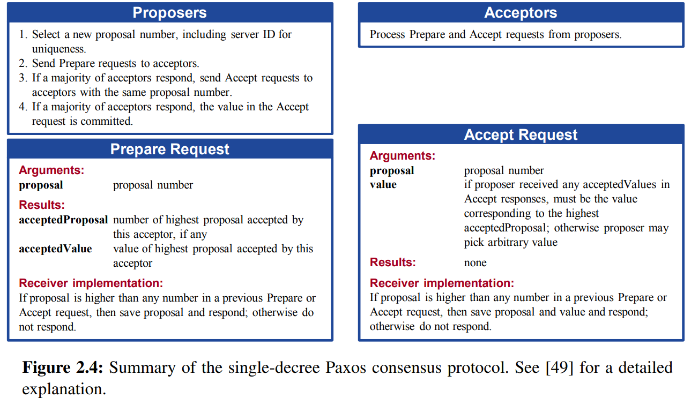

# [Paxos Made Simple](https://www.scs.stanford.edu/20sp-cs244b/sched/readings/paxos_made_simple.pdf)

PS：看的云里雾里的。

# 1. Introduction

用于实现容错分布式系统的 Paxos 算法一直被认为难以理解，这可能是因为其原始表述对许多读者来说如同希腊语般晦涩难懂 [5]。实际上，它是分布式算法中最简单、最明显的算法之一。其核心是一个共识算法 ——[5] 中的 “宗教会议” 算法。下一节将表明，这个共识算法几乎不可避免地源于我们希望它满足的特性。最后一节解释完整的 Paxos 算法，它是通过将共识直接应用于构建分布式系统的状态机方法而获得的 —— 这种方法应该是众所周知的，因为它是可能是分布式系统理论中最常被引用的文章的主题 [4]。

# 2. The Consensus Algorithm

## 2.1 The Problem

假设有一组可以提出值的进程。一个共识算法确保在提出的值中只选择一个。如果没有值被提出，那么就不应该选择任何值。如果一个值已经被选择，那么进程应该能够得知所选择的值。共识的安全性要求如下：

- 只有被提出的值才可能被选择。

- 只能选择一个值。

- <u>一个进程永远不会得知一个值被选择，除非这个值实际上已经被选择。</u>

  > ### 含义
  >
  > - 准确性要求
  >   - 强调进程获取信息的可靠性。在分布式系统的环境下，存在多个进程协同工作以达成共识选择一个值。这里规定进程不能误判某个值已被选中，只有当系统中确实已经完成了值的选择操作，进程才有正确的途径得知这个结果。
  > - 避免错误信息传播
  >   - 防止进程基于错误的 “已选值” 信息进行后续操作。如果进程可以随意认为某个值被选，那么整个系统的一致性和正确性将无法保证。例如，不同进程可能基于错误的已选值认知做出不同的决策，导致系统状态混乱。
  >
  > ### 作用
  >
  > - 维护系统的一致性
  >   - 是保证整个分布式系统在选择值这个操作上保持一致的关键约束条件。只有每个进程都遵循这个规则，才能确保系统在任何时刻对于所选值的认知是统一的，不会出现多个进程认为不同的值被选中的矛盾情况。
  > - 确保算法的正确性
  >   - 在 Paxos 算法的设计中，这个条件是算法能够正确运行并达成最终共识的重要组成部分。它与其他条件（如只能选一个值、只能选被提出的值等）共同作用，使得算法在复杂的分布式环境下能够稳定地实现从多个proposal值中正确地选出一个值，并让所有进程对这个结果达成一致的认知。

我们不会尝试去明确精确的活性要求。然而，目标是确保最终选择某个被提出的值，并且如果一个值已经被选择，那么一个进程最终能够得知这个值。

我们让共识算法中的三个角色由三类代理来执行：<u>proposers, acceptors, learners</u>。在一种实现中，一个单一的进程可能充当不止一个代理，但从代理到进程的映射在此我们并不关心。

假设代理之间可以通过发送消息进行通信。我们使用常见的异步、非拜占庭模型，其中：

- 代理以任意速度运行，可能会因停止而失败，并且可能会重新启动。由于所有代理在一个值被选择之后都可能失败然后重新启动，除非某个信息能够被一个失败然后重新启动的代理记住，否则解决方案是不可能的。
- 消息可能需要任意长的时间才能被传递，可以被复制，也可能会丢失，但它们不会被损坏。

## 2.2 Choosing a Value

存在一个单一的acceptor agent是最简单的选择value的方式。proposer向acceptor发送proposal，后者从中接收最早收到的那个。虽然很简单，但是这种方法是不能满足要求的，因为acceptor的故障将导致接下来的操作都无法进行。

因此我们需要尝试另一种选择值的方式。这次我们将有多个而不是一个acceptors。proposer将会向一个acceptor的集合发送value。acceptor可能会接受value。但是该value只有在足够多的acceptor都接受它的情况下才算被选择了。那么怎样才算足够大呢？为了确保只有一个value会被选中，我们可以认为一个足够大的agent集合由任意的agent majority组成。因为任意两个majority都至少有一个公共的agent，因此如果一个agent最多只能接收一个value，那么这种方法是可行的。

在没有故障和message丢失的情况下，我们想要有一个value能被选中，即使只有一个proposer提出了一个value。这就需要满足以下要求：

### P1. acceptor必须接收第一个它收到的proposal

但这一要求引发了一个问题。不同的proposal者可能几乎在同一时间提出几个值，这就导致了一种情况，即每个acceptors都接受了一个值，但没有一个单一的值被大多数acceptors所接受。即使只有两个proposal的值，如果每个值都被大约一半的acceptors所接受，那么单个acceptors的故障可能会使确定哪个值被选中变得不可能。

P1 以及只有当一个值被大多数acceptors接受时才选择该值的要求<u>意味着必须允许acceptors接受多个proposal</u>。我们通过为每个proposal分配一个（自然数）编号来跟踪acceptors可能接受的不同proposal，<u>所以一个proposal由一个proposal编号和一个值组成</u>。为了避免混淆，我们要求不同的proposal具有不同的编号。如何实现这一点取决于具体的实现方式，所以目前我们只是假设它成立。<u>当具有该值的单个proposal被大多数acceptors接受时，就选择了一个值。</u>在这种情况下，我们说该proposal（以及它的值）已被选中。

我们可以允许选择多个proposal，但我们必须保证所有被选中的proposal具有相同的值。通过对proposal编号进行归纳，只需保证：

### P2.如果一个value为v的proposal被选中，那么每个具有更高编号且被选中的proposal都具有值 v。

由于编号是全局有序的，条件 P2 保证了关键的安全性，即只选择一个值。

为了被选中，一个proposal必须被至少一个acceptors接受。所以，我们可以通过满足以下条件来满足 P2：

#### P2a.如果一个value为v的proposal被选中，那么任何acceptor接受的每个更高编号的proposal都具有值 v。

我们仍然维持 P1 以确保某个proposal被选中。由于通信是异步的，可能在某个特定acceptors c 从未接收到任何proposal的情况下，一个proposal就被选中了。假设一个新的proposers “醒来” 并发出一个具有不同值的更高编号的proposal。P1 要求 c 接受这个proposal，这就违反了 P2a。同时维持 P1 和 P2a 需要将 P2a 强化为：

#### P2b.如果一个value为v的proposal被选中，那么之后任何proposer发出的high-numbered proposal都有value v

由于一个proposal必须先由proposers发出，然后才能被acceptors接受，所以 P2b 意味着 P2a，而P2a又意味着 P2b。

为了弄清楚如何满足 P2b，让我们考虑如何证明它成立。我们会假设编号为 m 且值为 v 的某个proposal被选中，然后证明任何编号为 n>m 的proposal也具有值 v。我们通过对 n 进行归纳使证明更容易，所以在附加假设中，即对于编号在 m…(n - 1) 之间的每个proposal都具有值 v 的情况下，我们可以证明编号为 n 的proposal具有值 v，其中 i…j 表示从 i 到 j 的数字集合。对于编号为 m 的proposal被选中，必须存在一个由大多数acceptors组成的集合 C，使得 C 中的每个acceptors都接受了它。结合这个归纳假设，m 被选中的假设意味着：

> C 中的每个acceptors都接受了编号在 m…(n - 1) 之间的一个proposal，并且任何acceptors接受的编号在 m…(n - 1) 之间的每个proposal都具有值 v。

由于任何由大多数acceptors组成的集合 S 都至少包含 C 的一个成员，通过确保维持以下不变性，我们可以得出编号为 n 的proposal具有值 v：

#### P2c.对于任何 v 和 n，如果发出一个值为 v 且编号为 n 的proposal，那么存在一个由大多数acceptors组成的集合 S，使得要么（a）S 中的任何acceptors都没有接受编号小于 n 的任何proposal，要么（b）v 是 S 中的acceptors-所接受的编号小于 n 的所有proposal中的-编号最高的proposal的值。 

简单来说，p2c代表只会出现如下两种情况：majority中要么没有编号小于n的proposal；若存在编号小于n的proposal，那么在 S 中的acceptors所接受的编号小于 n 的所有proposal中，编号最高的那个proposal的值为 v，即小于n的最大编号的proposal的值是v。

因此，我们可以通过维持 P2c 的不变性来满足 P2b。

<u>为了维持 P2c 的不变性，想要发出编号为 n 的proposal的proposers必须了解在一些大多数acceptors中每个acceptors已经或将要接受的编号小于 n 的最高编号proposal（如果有的话）</u>。了解已经被接受的proposal很容易；预测未来的接受情况则很困难。proposers不试图预测未来，而是通过提取一个承诺来控制未来，即不会有任何这样的接受情况**。换句话说，proposers要求acceptors不再接受编号小于 n 的任何proposal**。这就引出了以下发出proposal的算法：

1. proposers选择一个新的proposal编号 n，并向某个acceptors集合中的每个成员发送一个请求，要求其回应，即acceptors的回复应该包含如下两个信息：

   1. 一个承诺，即永远不再接受编号小于 n 的proposal；

   2. 如果有的话，它所接受的编号小于 n 的最高编号proposal。 

   我将这样的请求称为编号为 n 的准备请求（prepare request）。

2. 如果proposers从大多数acceptors那里收到了所请求的回应，那么它可以发出一个编号为 n 且值为 v 的proposal，其中 v 是回应中编号最高的proposal的值。如果回应者报告没有proposal，那么 v 可以是proposers选择的任何值。

proposers通过向一组acceptors发送一个请求来发出proposal，请求该proposal被接受。（这不一定是对刚开始的请求做出回应的同一组acceptors。）我们将此称为accept请求。

> proposers的行为分为prepare和accept两个阶段：
>
> - prepare阶段是为了了解当前的majority acceptors中小于n的最高编号的proposal(如果有)。是为了确认proposers发出的这个编号为n的请求是否合法。
> - accept阶段是在prepare阶段成立的前提下，正式的发出这个proposal的行为。

这描述了proposers的算法。那么acceptors呢？它可以从proposers那里收到两种请求：prepare请求和accept请求。acceptors可以忽略任何请求而不会影响安全性。所以，我们只需要说明它何时被允许响应请求。它总是可以响应prepare请求。当且仅当它没有承诺不接受时，它可以响应accept请求并接受proposal。换句话说： 

> P1a .一个acceptors可以接受编号为 n 的proposal，当且仅当它没有对编号大于 n 的prepare请求做出回应。

请注意，P1a 包含了 P1。

现在我们有了一个完整的算法来选择一个满足所需安全属性的值 —— 假设 proposal 编号是唯一的。通过进行一个小的优化可以得到最终算法。

假设一个 acceptor 收到一个编号为 n 的 prepare request，但它已经对一个编号大于 n 的 prepare request 做出了回应，从而承诺不接受任何编号为 n 的新 proposal。那么 acceptor 就没有理由回应这个新的 prepare request，因为它不会接受 proposer 想要发出的编号为 n 的 proposal。所以我们让 acceptor 忽略这样的 prepare request。我们也让它忽略对它已经接受的 proposal 的 prepare request。

> acceptor不会接受任何小于等于自己当前已经接受的最大编号n的任何请求。

<u>有了这个优化，acceptor 只需要记住它曾经接受过的编号最高的 proposal 以及它回应过的编号最高的 prepare request 的编号。</u>因为无论是否出现故障，P2c 都必须保持不变，所以即使 acceptor 出现故障并重新启动，它也必须记住这个信息。**请注意，proposer 可以随时放弃一个 proposal 并完全忘记它 —— 只要它永远不尝试用相同的编号发出另一个 proposal。**

> 在paxos算法中，一个 proposal 的编号只能被使用一次，。如果 proposer 放弃了一个 proposal，只要它不再用相同编号发出新的 proposal，就可以完全忘记这个已放弃的 proposal。
>
> 即使某个编号的 proposal 没有被大多数 acceptors 接受，也不能再次使用这个编号。这是因为算法设计要保证安全性和一致性条件，重复使用编号可能会导致混乱和无法确定最终被选择的值。这就意味着 acceptors 已经接受的请求大概率会出现编号不连续的情况，比如 proposer 可能在发出编号为 5 的 proposal 后放弃，接着发出编号为 7 的 proposal，从而使 acceptors 已接受的请求中出现编号不连续的现象。

将 proposer 和 acceptor 的行动放在一起，我们可以看到该算法在以下两个阶段中运行（single-paxos算法）：

阶段 1：（a）Proposer 选择一个 proposal 编号 n，并向大多数 acceptor 发送编号为 n 的 prepare request。（b）如果 acceptor 收到一个编号为 n 的 prepare request，且 n 大于它已经回应过的任何 prepare request 的编号，那么它会回应这个请求，承诺不再接受任何编号小于 n 的 proposal，并提供它已经接受的编号最高的 proposal（如果有）。

阶段 2：（a）如果 proposer 从大多数 acceptor 那里收到对其编号为 n 的 prepare request 的回应，那么它会向这些 acceptor 中的每一个发送一个编号为 n、值为 v 的 accept request，其中 v 是回应中编号最高的 proposal 的值，如果回应中没有 proposal，v 可以是任何值。（b）如果 acceptor 收到一个编号为 n 的 accept request，除非它已经对一个编号大于 n 的 prepare request 做出回应，否则它会接受这个 proposal。

> 对于a步骤，因为不同的 acceptor 可能已经接受了不同编号和值的 proposal。有的 acceptor 可能接受了较高编号的 proposal，有的可能接受了较低编号的 proposal，或者有的 acceptor 可能还没有接受任何 proposal。这种情况下，从回应中确定一个值意味着需要在这些可能不一致的状态中找到一个相对一致的值（即最高编号 proposal 的值）来推进算法的下一步。所以可以看出这些 acceptors 当前的状态存在不一致性。
>
> 因为我们确保的是majority，所以这是合理的。

Proposer 可以提出多个 proposal，只要它对每个 proposal 都遵循该算法。它可以在协议的任何时候放弃一个 proposal。（即使该 proposal 的请求和 / 或回应可能在 proposal 被放弃很久之后才到达目的地，正确性也能得到维护。）如果某个 proposer 已经开始尝试发出一个更高编号的 proposal，那么放弃当前 proposal 可能是个好主意。<u>因此，如果 acceptor 因为已经收到一个更高编号的 prepare request 而忽略一个 prepare request 或 accept request，那么它应该通知 proposer，proposer 应该放弃其 proposal。这是一个不影响正确性的性能优化。</u>

## 2.3 Learning a Chosen Value（对于learner角色而言）

为了得知一个值已被选中，learner必须发现一个proposal已被大多数acceptor接受。明显的算法是让每个acceptor在接受一个proposal时，向所有learner做出回应，将proposal发送给他们。这使得learner能够尽快了解到已被选中的值，但这要求每个acceptor对每个learner做出回应 —— 回应的数量等于acceptor的数量和learner的数量的乘积。

非拜占庭故障的假设使得一个learner很容易从另一个learner那里得知一个值已被接受。我们可以让acceptor向一个特殊的learner做出回应，当一个值被选中时，这个特殊的learner再通知其他learner。这种方法需要额外一轮时间让所有learner发现被选中的值。它也不太可靠，因为这个特殊的learner可能会失败。但它所需的回应数量仅等于acceptor的数量和learner的数量之和。

更一般地，acceptor可以向一组特殊的learner做出回应，当一个值被选中时，每个特殊的learner都可以通知所有learner。使用更大的特殊learner集合可以提供更高的可靠性，但代价是通信复杂性更高。

因为message的丢失，可能没有learner知道已经有value被选中了。learner可以直接问acceptor它们接受了什么proposal，但是acceptor的故障可能让我们无法知道是否有majority接受了一个特定的proposal。这种情况下，learner只能在有新的proposal被接受的时候才能确定被选中的value是什么。如果一个learner想要知道一个value是否被选中，它可以让一个proposer发送一个proposal，使用上文描述的算法。

## 2.4 Progress

很容易构建这样一个场景：<u>两个proposer各自不断发出一系列编号不断增加的proposal，但没有一个被选中。</u>

proposer p 完成了编号为 n1 的proposal的阶段 1。然后另一个proposer q 完成了编号为 n2（n2>n1）的proposal的阶段 1。proposer p 对编号为 n1 的proposal的阶段 2 的accept请求被忽略，因为acceptor都承诺不接受任何编号小于 n2 的新proposal。所以，proposer p 接着开始并完成了编号为 n3（n3>n2）的新proposal的阶段 1，导致proposer q 的第二阶段 2 对编号为 n2 的proposal的accept请求被忽略。如此等等。

<u>为了保证能够推进进展，必须选择一个特殊的proposer作为唯一尝试发出proposal的人。</u>如果这个特殊的proposer能够成功地与大多数acceptor进行通信，并且如果它使用一个编号大于任何已经使用过的编号的proposal，那么它将成功地发出一个被接受的proposal。通过放弃一个proposal并在得知有更高编号的请求时再次尝试，这个特殊的proposer最终将选择一个足够高的proposal编号。

如果系统足够多的部分都工作正常（proposer, acceptors以及交互网络），那么通过选出一个单一的distinguished proposer就能保持系统的活力。由Fischer, Lynch, and Patterson著名的结论可得，选举一个proposer的可靠算法必须要么使用randomness，要么使用real time——比如，使用超时。但是，无论选举成功还是失败，安全性总是可以保证的。

> 即使用单一proposer的方式确保不会出现上述无法取得进展的情况，强leader，如raft算法。

## 2.5 The Implementation

Paxos算法假设了一个进程网络。在这个共识算法中，每个进程扮演着proposer, acceptor和learner的角色。该算法需要选择一个leader，来扮演distinguished proposer和distinguished learner的角色。Paxos共识算法正如上文所描述的那样，请求和回复都以ordinary message的形式发送。（Response message会用相应的proposal number标记为了防止混淆）我们需要使用stable storage（会在故障时候保存）来维护那些acceptor必须保存的信息。acceptor会在真正发送response之前将它记录下来。

<u>接下来所有的内容都将用于描述如何保证两个proposal不会有相同的number。</u>不同的proposer从不相交的编号集合中选择它们的编号，所以两个不同的proposer永远不会发出具有相同编号的proposal。每个proposer（在稳定存储中）记住它尝试发出的编号最高的提议，并以比它已经使用过的任何编号都高的proposal编号开始阶段 1。

### 2.5.1 为什么需要leader和proposer
在 Paxos 算法中，即使有了 leader，proposer 仍然有其存在的必要性：

**一、系统的容错性和健壮性**

- 虽然 leader 在正常情况下能够高效地协调和推进共识的达成，但 leader 可能会出现故障。如果只有 leader 能提出提议，那么一旦 leader 失效，整个系统可能会陷入停滞。而有了多个 proposer，当 leader 失效时，系统可以重新选举 leader 或者其他 proposer 可以尝试提出提议，继续推动共识的达成，从而提高了系统的容错性和健壮性。
- 即使在有 leader 的情况下，不同的 proposer 也可以作为潜在的备份和补充机制，确保系统在各种异常情况下仍然能够继续运行。

**二、分布式环境的不确定性**

- 在分布式系统中，网络延迟、消息丢失等情况是常见的。有时候 leader 的消息可能无法及时到达所有的 acceptor 或其他进程。这时，proposer 可以在一定程度上增加系统的灵活性。例如，如果某个 acceptor 在一段时间内没有收到 leader 的提议，它可能会响应其他 proposer 的提议，从而避免系统因为等待 leader 而陷入长时间的阻塞。
- 不同的 proposer 可能位于不同的网络位置或具有不同的性能特点，它们可以适应分布式环境中的各种变化和不确定性，为系统的运行提供更多的可能性。

**三、防止单点故障和权力集中**

- 如果只有 leader 能提出提议，那么 leader 就成为了系统的单点故障点和权力集中点。一旦 leader 出现问题或者被恶意攻击，整个系统可能会面临严重的风险。而多个 proposer 的存在可以分散权力，降低单点故障的影响，使得系统更加安全可靠。
- 多个 proposer 之间的竞争也可以在一定程度上防止 leader 滥用权力或者出现错误决策，从而保证系统的公平性和正确性。

在 Paxos 算法中，leader 可以被看作是拥有特殊地位和权力的 proposer。

一方面，leader 在系统中扮演着重要的协调角色，它通常以更有序的方式提出提议，并且其提议更容易被接受者优先考虑。这是因为 leader 使用编号大于任何已使用过的编号的提议，提高了提案被接受的可能性。

另一方面，在正常情况下，系统确实会优先听从 leader 的提议，以确保共识的高效达成。然而，其他 proposer 仍然存在并可能在特定情况下发挥作用，比如当 leader 失效或者出现网络问题导致 leader 的提议无法及时传播时，其他 proposer 可以尝试提出提议来维持系统的运行。

但需要注意的是，这种 “优先听 leader” 并不是绝对的垄断权力，而是在系统设计中为了提高效率和稳定性而做出的一种策略安排。整个系统仍然依赖于多个角色的相互协作和制衡，以确保共识的正确达成。

# 3. Implementing a State Machine

一种实现分布式系统的简单方法是将其作为一组向中央服务器发出命令的客户端集合。服务器可以被描述为一个确定性状态机，它按照某种顺序执行客户端命令。状态机有一个当前状态；它通过接受一个命令作为输入，产生一个输出和一个新状态来执行一个步骤。例如，分布式银行系统的客户端可能是出纳员，而状态机的状态可能由所有用户的账户余额组成。取款将通过执行一个状态机命令来完成，当且仅当余额大于取款金额时，该命令会减少账户余额，并产生旧余额和新余额作为输出。

如果使用单个中央服务器的实现方式中该服务器出现故障，那么就会失败。因此，我们使用一组服务器，每个服务器都独立地实现状态机。因为状态机是确定性的，所以如果所有服务器都执行相同的命令序列，那么它们将产生相同的状态和输出序列。发出命令的客户端可以使用任何服务器为其生成的输出。

为了保证所有服务器都执行相同的状态机命令序列，我们实现了一系列独立的 Paxos 共识算法实例，第 i 个实例所选择的值是序列中的第 i 个状态机命令。每个服务器在算法的每个实例中都扮演所有角色（proposer、acceptor 和 learner）。目前，我假设服务器集合是固定的，共识算法的所有实例都使用相同的代理集合。

> “实例”（instance）可以理解为对 Paxos 共识算法的一次具体运行。 每个实例对应着对一个特定状态机命令的共识达成过程。例如，第 i 个实例就是为了确定第 i 个状态机命令而运行的一次 Paxos 共识算法过程。不同的实例有着不同的提议编号和要达成共识的值，这些值最终将构成状态机命令的序列，推动整个分布式系统的状态变化和操作执行。

在通常的操作中，只有一个server能够被选为leader并作为distinguished proposer（**唯一的proposal发送者**）在共识算法的所有实例中。client将命令发送给leader，leader决定每个命令应该放在序列的哪个地方。如果leader决定一个特定的client命令应该作为第135个命令，那么它就会将该命令作为共识算法第135个实例。这通常都会成功。但也有可能因为发生故障或者有另一个server认为自己是leader并且对第135条命令是什么有它自己的想法。但是共识算法确保了第135条命令最多只有一个。

Paxos共识算法效率的关键在于直到phase 2之前都不对提出的value进行选择。回忆一下，是在完成了phase 1之后才知道要发送的value要么已经被决定了，要么proposer可以被任意选择。

我现在要讨论的是在正常执行时，Paxos state machine是怎么工作的。之后，还会描述什么情况下会出错。我考虑的是当前一个leader刚刚发生故障但是新的leader还没有选举出来的情况（系统刚刚启动时是一个特殊的情况，那时候还没有任何命令被提交）。

新的leader，也是共识算法所有实例的leader，应该了解已经选择的大多数命令。假设它知道命令1-134,138和139——即实例1-134，138和139选择的值（接下来我们会知道命令序列中的gap是怎么产生的）。之后，它将执行实例135-137的phase 1以及所有大于139的实例（下面我将描述这是如何完成的）。假设这些操作的执行结果确定了实例135和140的value，但是其他实例的value还是未确定的。之后，leader将会执行实例135和140的phase 2，从而选择了命令135和140。

leader以及那些获取了leader已知的所有command的server现在可以执行命令1-135。然而，它仍然不能执行命令138-140，即使它已经知道它的内容了，因为命令136和137并没有被选择。leader可以将接下来client请求的两个命令作为命令136和137。然而，我们通过发送特殊的让状态不发生改变的"noop"命令来马上填充gap（通过执行共识算法的实例136和137的phase 2来实现）。一旦这些no-op命令被选中，命令138-140就可以执行了。

命令1-140已经选择完毕。leader也完成了共识算法所有大于140的实例的phase 1。它将client发送的下一个请求赋值为141，并且将它作为共识算法实例141的value。之后再将用户的下一个请求作为命令142，如此往复。

leader可以在它知道已经发送的命令141被选择之前就发送命令142。可能发送命令141的所有数据都会丢失，命令142也可能在所有server都不知道leader发送的命令141的任何内容之前被选择。当leader没有收到它希望得到的关于实例141的phase 2信息的回复时，它会对这些信息进行重发。如果所有运行正常的话，发送的命令将会被选中。然而，在一开始可能会发生故障，从而在已选中的命令序列中留下一个gap。一般来说，假设一个leader可以提前获取α个命令——这意味着在命令1到i被选中的前提下，它可以发送命令i + 1到i + α之间的命令。因此，一个至多为α−1条命令大的gap可能会出现。

一个新的被选中的leader可以执行无数多个共识算法实例的phase 1——在上面的场景中，即为实例135-137以及所有大于139的实例。通过对所有实例使用同一个proposal number，它可以用给其他server发送一个single reasonably short message来实现。在phase 1，如果一个acceptor已经从一些proposer收到phase 2信息的时候，它就会不仅仅回复一个简单的Ok。（在例子中，就是对于实例135和140）因此，server（作为acceptor）可以用一个single reasonably short message来回复所有的instance。在无数个实例的phase 1这样执行不会产生任何问题。

由于 leader 的失败以及选举一个新的 leader 应该是罕见事件，所以执行一个状态机命令的有效成本 —— 即就命令 / 值达成共识的成本 —— 仅仅是执行共识算法的阶段 2 的成本。可以证明，在存在故障的情况下，Paxos 共识算法的阶段 2 具有任何用于达成一致的算法中最小的可能成本 [2]。因此，Paxos 算法在本质上是最优的。

这段话主要在强调以下几点：

- 因为 leader 失败和新 leader 选举不常发生，所以在大多数情况下，执行状态机命令达成共识的主要成本来自于共识算法的阶段 2。
- 通过论证表明在存在故障的场景下，Paxos 共识算法的阶段 2 成本是所有能达成一致的算法中最低的。
- 基于以上两点得出结论，即 Paxos 算法在本质上是最优的算法，因为它在达成共识方面具有高效性和低成本的优势。

这段关于系统正常运行的讨论假设除了在当前 leader 失效到新 leader 被选举出来之间的短暂时期外，始终只有一个 leader。在异常情况下，leader 选举可能会失败。如果没有服务器充当 leader，那么就不会有新的命令被提议。如果多个服务器认为自己是 leader，那么它们可能在共识算法的同一实例中都提议值，这可能会阻止任何值被选中。<u>然而，安全性得以保留 —— 两个不同的服务器永远不会在被选为第 i 个状态机命令的值上产生分歧。选举出一个单一的 leader 只是为了确保系统的进展。</u>

> “实例”（instance）可以理解为对 Paxos 共识算法的一次具体运行。 每个实例对应着对一个特定状态机命令的共识达成过程。例如，第 i 个实例就是为了确定第 i 个状态机命令而运行的一次 Paxos 共识算法过程。不同的实例有着不同的提议编号和要达成共识的值，这些值最终将构成状态机命令的序列，推动整个分布式系统的状态变化和操作执行。

如果服务器集合可以改变，那么就必须有某种方法来确定哪些服务器执行共识算法的哪些实例。

最容易的方法是通过状态机本身来实现。当前的服务器集合可以成为状态的一部分，并且可以通过普通的状态机命令来进行更改。我们可以让 leader 提前 α 个命令，方法是让执行共识算法的第 i + α 个实例的服务器集合由执行第 i 个状态机命令后的状态来指定。这允许实现一个简单的、但可以任意复杂的重新配置算法。

**一、确定服务器与共识算法实例的对应关系**

如果服务器的集合是可变的，那就需要一种机制来明确不同的服务器具体负责执行共识算法的哪些特定实例。因为在分布式系统中，服务器的变动可能会影响到共识算法的执行，所以必须有办法确定新的服务器组合如何参与到共识算法的各个实例中。

**二、利用状态机本身确定对应关系**

最直接的方式是通过状态机来解决这个问题。把当前的服务器集合作为状态的一部分，这样就可以通过普通的状态机命令来调整服务器集合。比如，当系统状态发生变化时，可以通过执行特定的状态机命令来增加或减少参与共识算法的服务器。

**三、让 leader 提前处理命令**

通过一种方式让 leader 能够提前处理一些命令。具体来说，执行第 i 个状态机命令后，根据此时的系统状态来确定执行共识算法的第 i + α 个实例的服务器集合。这样 leader 就可以提前为后续的命令做准备，因为它知道哪些服务器将参与到后续的共识算法实例中。

**四、实现复杂的重新配置算法**

这种机制允许实现一个简单的重新配置算法，而且这个算法可以根据需要变得任意复杂。因为可以通过状态机命令灵活地调整服务器集合，并且 leader 可以提前了解后续的服务器安排，所以可以根据不同的需求和场景来设计复杂的服务器重新配置策略，以适应系统的动态变化。

# 4. single-degree paxos(来自[CONSENSUS: BRIDGING THEORY AND PRACTICE](https://web.stanford.edu/~ouster/cgi-bin/papers/OngaroPhD.pdf))

下图是对单指令Paxos协议的一个简要总结，大体上来说有点像两阶段提交，不过prepare是为了先提前预约一个proposal号码（类似于logindex），之后的accept请求则发送对应的值，欲了解更多细节请见[Paxos Made Alive](https://read.seas.harvard.edu/~kohler/class/08w-dsi/chandra07paxos.pdf)、[Paxos Made Simple](http://lamport.azurewebsites.net/pubs/paxos-simple.pdf)：

### Proposers

1. 选择一个新的proposal number，为了唯一性，该proposal number应该包含当前的server ID。
2. 发送Prepare请求给接收者（Acceptors）。
3. 如果大多数Acceptors都回复了，再用相同的proposal number构建Accept请求发送给这些Acceptors。（Accept请求是用来真正发送Value的）
4. 如果大多数Acceptors都回复了Accept请求，那么在这个Accept请求中的值被视作committed。

### Acceptors

负责处理来自Proposer的Prepare请求和Accept请求。

### Prepare Request

| 参数     | 解释                           |
| -------- | ------------------------------ |
| proposal | proposal号码，应该是全局唯一的 |

| 返回值（Reply）  | 解释                                               |
| ---------------- | -------------------------------------------------- |
| acceptedProposal | 该acceptor已经接受的最高的proposal number          |
| acceptedValue    | 该acceptor已经接受的最高proposal number对应的Value |

`Receiver implementation`（Acceptor端实现）：

如果收到的proposal号码比之前的任何Prepare或Accept请求携带的proposal号码都高，将这个proposal存下来，并回复那个proposer；否则不做回复

### Accept Request

| 参数     | 解释                                                         |
| -------- | ------------------------------------------------------------ |
| proposal | proposal号码                                                 |
| value    | 如果proposer曾经从Acceptor的回复中收到过任何的acceptedValues，那么这个值一定是最高的acceptedProposal对应的值；否则proposer可能挑选一个任意值。 |

`Receiver implementation`（Acceptor端实现）：

如果收到的proposal号码比之前的任何Prepare或Accept请求携带的proposal号码都高，将这个proposal存下来，并回复那个proposer；否则不做回复

Raft作者说Paxos算法有如下的缺点：

- 单指令paxos本身就密集且晦涩，Multi-Paxos在上述基础上增加了额外的复杂性和细微的边喝，这就更难理解了。
- 很难用Multi-Paxos实现一个系统：lamport在论文中大多数是关于单指令paxos的描述，关于multi-paxos只是给出了一个框架，没有良好的实现基础，有很多人尝试去实现Multi-Paxos，但实现结果并不一致，和lamport的论文中描述的Multi-Paxos框架也不同。
- Paxos算法核心是每个peer都是对等的（尽管可以支持弱领导人特性来优化性能）。如果必须做一系列的决策，那么首先选举一位领导者，然后由领导者协调决策会更简单更快速。 （第11章讨论了Egalitarian Paxos，**这是Paxos的最新变体之一，它不使用领导者，但在某些情况下可能比使用领导者的算法更有效；**然而，该算法比基于领导者的算法复杂得多。）
